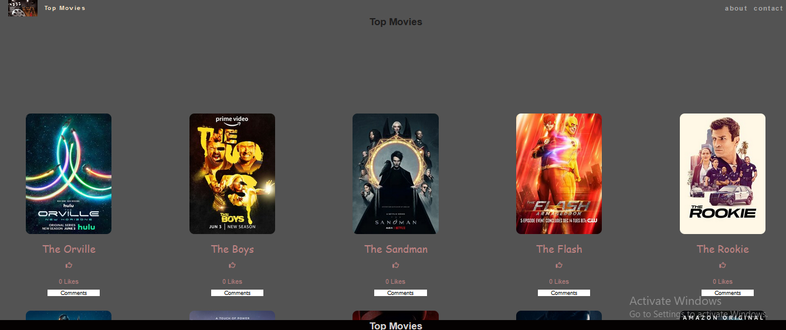

# movieHub

This website presents the best Tv shows. We have used TVmaze API to get the movie content. we have used Javascript, HTML and CSS to build the website.

## Overview

## Built With

- JavaScript
- HTML
- CSS

## Overview

    

## Live Demo

[Live Demo Link](https://milen-ale.github.io/movieHub/)

[Video Demonstration](https://drive.google.com/file/d/1mhAsbTUOKVE63LAskGVtuMM8jbEzb4eM/view?usp=sharing)

## Getting Started

To use this project you need to clone the repository to your local machine, and open the folder then run index.html file which is the main file of the project.

To get a local copy up and running follow these simple example steps.

1. run - git clone https://github.com/milen-ale/MovieHub.git
2. run - cd MovieArena
3. run - code . (to open the directory in VSCode you can change the command if you have another editor)
4. run - npm install
5. run - npm start (to open the localhost to the app)

### Prerequisites

To work on this project locally you need to have Node.js installed in your machine.

### Setup

- To run this project, you need to:
- VSCode
- JavaScript/HTML&CSS extensions
- NPM
- Webpack

## Authors

👤 Milen Alebel

- GitHub: [@milen-ale](https://github.com/milen-ale)
- Twitter: [@milenalebel](https://twitter.com/milenalebel)
- LinkedIn: [Milen Alebel](https://linkedin.com/in/MilenAlebel)

👤 Thokozani ngubane

- GitHub: [@MxoDevops](https://twitter.com/MxoDevops)
- Twitter: [@godecuy](https://github.com/godecuy)
- LinkedIn: [@thokozaningubane](https://www.linkedin.com/in/thokozaningubane/)

## 🤝 Contributing

Contributions, issues, and feature requests are welcome!

Feel free to check the [issues page](../../issues/).

## Show your support

Give a ⭐ if you like this project!

## Acknowledgments

- Hat tip to anyone whose code was used
- Inspiration
- etc

## Show your support

Give a ⭐️ if you like this project!

## 📝 License

This project is MIT licensed.
